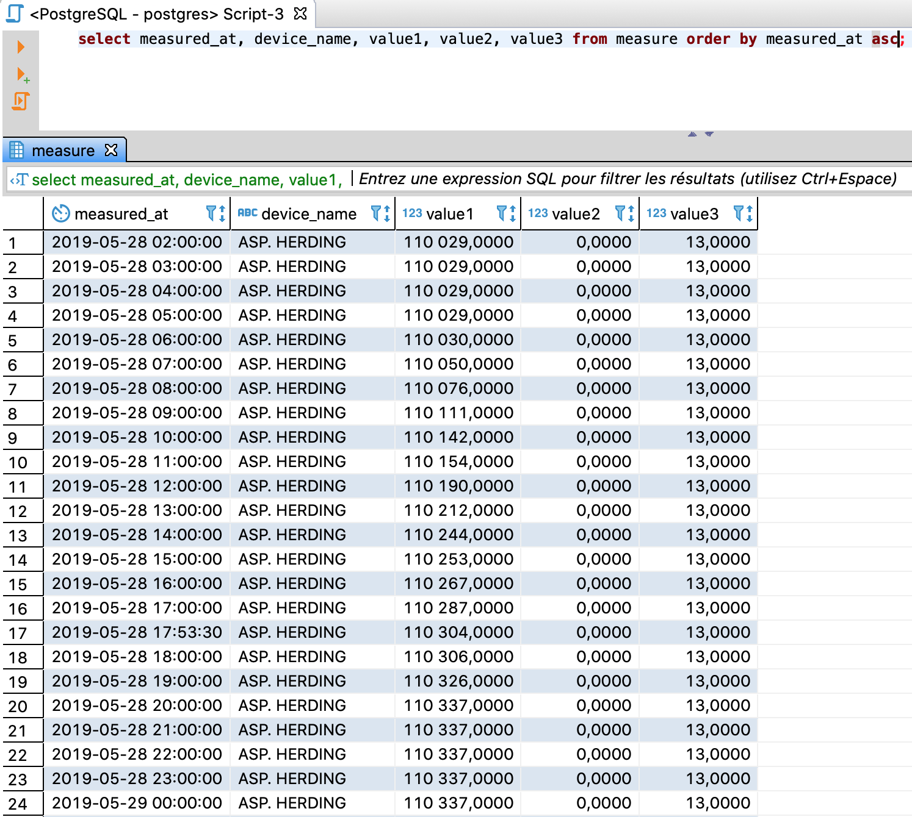

# hdd-socomec
Import des données des capteurs de l'herbier du diois à partir de CSV dans un postgres.

## pre requis

- installer nodejs: https://nodejs.org/en/
- installer docker et docker compose: https://www.docker.com/

## développement

import des nodes modules

```sh
yarn install
```

lancer la base de données

```sh
yarn db:start
```

initialiser la base de données

```sh
yarn db:migrate
```

insérer les données sur les capteurs

```sh
yarn db:seed
```

lancer l'application

```sh
yarn start
```

## résulat



les données des csv sont importées dans une base de données avec la structure 

| colonne         | type     | description                     |
| --------------- | -------- | ------------------------------- |
| device_name     | string   | nom du connecteur               |
| created_at      | datetime | date de l'enregistrement en BDD |
| measured_at     | datetime | date de la prise des mesures    |
| load_name1      | string   | load name                       |
| usage1          | string   | usage                           |
| nature1         | string   | nature de la mesure 1           |
| measured_value1 | string   | valeur mesurée pour 1             |
| unit1           | string   | unité de la mesure 1            |
| scale1          | float    | scale                           |
| value1          | float    | valeur de la mesure 1           |
| load_name2      | string   | load name                       |
| usage2          | string   | usage                           |
| nature2         | string   | nature de la mesure 2           |
| measured_value2 | string   | valeur mesurée pour 2             |
| unit2           | string   | unité de la mesure 2            |
| scale2          | float    | scale                           |
| value2          | float    | valeur de la mesure 2           |
| load_name3      | string   | load name                       |
| usage3          | string   | usage                           |
| nature3         | string   | nature de la mesure 3           |
| measured_value3 | string   | valeur mesurée pour 3             |
| unit3           | string   | unité de la mesure 3            |
| scale3          | float    | scale                           |
| value3          | float    | valeur de la mesure 3           |
| load_name4      | string   | load name                       |
| usage4          | string   | usage                           |
| nature4         | string   | nature de la mesure 4           |
| measured_value4 | string   | valeur mesurée pour 4             |
| unit4           | string   | unité de la mesure 4            |
| scale4          | float    | scale                           |
| value4          | float    | valeur de la mesure 4           |
| load_name5      | string   | load name                       |
| usage5          | string   | usage                           |
| nature5         | string   | nature de la mesure 5           |
| measured_value5 | string   | valeur mesurée pour 5             |
| unit5           | string   | unité de la mesure 5            |
| scale5          | float    | scale                           |
| value5          | float    | valeur de la mesure 5           |

